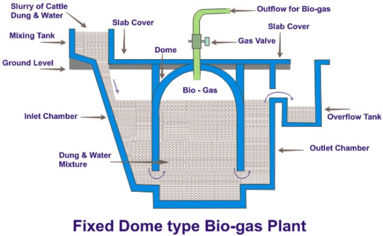

# IRER Assignment 03

## Questions

1. With a neat diagram of the floating drum biogas plant write its construction & working with advantages and limitations.
2. What is Bio-Diesel ? How can it be manufactured ?
3. Explain the constructional details and working of the fixed dome biogas plant with advantages and limitations.
4. What are the advantages of Bio-Diesel for a country like India ?
5. Discuss Thermal Gassification with neat sketch.
6. Explain constructional details and working of KVIC digester.
7. What are the factors affecting Bio-digestion. Explain any four factors in details.
8. What are the various problems associated with biogas plant? What are the remedies for it?
9. Enlist the site selection consideration for Biogas plant.

## Answers

# Floating Drum Biogas Plant

## Construction

The floating drum biogas plant, also known as the KVIC (Khadi and Village Industries Commission) model, consists of the following key components:

1. Digester: A cylindrical, underground fermentation chamber made of brick masonry or concrete.
2. Inlet: A sloped pipe for feeding the organic waste and water mixture into the digester.
3. Outlet: An overflow pipe for removing the digested slurry.
4. Gas holder: A inverted steel drum that floats on the slurry surface and collects the produced biogas.
5. Guide frame: A structure that supports and guides the movement of the gas holder.
6. Gas outlet pipe: Connected to the top of the gas holder for biogas extraction.
7. Mixing pit: Located near the inlet for preparing the feedstock mixture.
8. Slurry pit: Situated at the outlet to collect the digested slurry.

## Working Principle

1. Organic waste (e.g., animal dung, agricultural residues) is mixed with water in the mixing pit to form a slurry.
2. The slurry is fed into the digester through the inlet pipe.
3. Anaerobic microorganisms in the digester break down the organic matter, producing biogas (primarily methane and carbon dioxide).
4. The produced biogas collects in the floating drum, causing it to rise.
5. As more gas is produced, the drum continues to rise, creating pressure for gas extraction.
6. The biogas is extracted through the gas outlet pipe for various applications (cooking, lighting, etc.).
7. Digested slurry overflows through the outlet pipe into the slurry pit, where it can be collected for use as fertilizer.

## Advantages

1. Visual indication of gas production: The rising and falling of the gas holder provides a clear indication of gas volume.
2. Constant gas pressure: The weight of the drum ensures uniform gas pressure for consistent appliance performance.
3. Easy gas extraction: The floating drum design facilitates simple gas extraction without the need for complex pressure regulation.
4. Robust construction: The brick or concrete digester is durable and long-lasting.
5. Suitable for various feedstocks: Can process different types of organic waste effectively.
6. Continuous feeding possible: Allows for daily feeding of organic waste without interrupting gas production.

## Limitations

1. Higher initial cost: The steel gas holder increases the overall construction cost.
2. Maintenance requirements: The metal drum is prone to corrosion and requires regular painting and maintenance.
3. Temperature sensitivity: In colder climates, the exposed gas holder can lead to reduced gas production due to heat loss.
4. Potential for gas leakage: The moving parts and connections in the gas holder can lead to gas leaks if not properly maintained.
5. Limited scalability: The floating drum design becomes less practical for very large-scale applications.
6. Vulnerable to damage: The exposed gas holder can be damaged by external factors like severe weather or accidents.
7. Scum formation: The floating drum can sometimes get stuck due to the formation of a scum layer on the slurry surface.

# Bio-Diesel: Definition and Manufacturing Process

## Definition

Biodiesel is a renewable, biodegradable fuel manufactured from vegetable oils, animal fats, or recycled cooking oils. It is a clean-burning substitute for petroleum-based diesel fuel and is compatible with compression-ignition engines designed to run on conventional diesel fuel with little or no modification.

Chemically, biodiesel is composed of mono-alkyl esters of long-chain fatty acids derived from renewable lipid sources. It is typically produced through a process called transesterification, where the triglycerides in the oils or fats react with an alcohol (usually methanol) in the presence of a catalyst to form esters and glycerol.

## Manufacturing Process

The production of biodiesel involves several steps:

1. Feedstock preparation:
   - Selection of appropriate feedstock (e.g., soybean oil, rapeseed oil, waste cooking oil)
   - Filtration and pre-treatment to remove impurities
   - For waste oils: Acid pre-treatment to reduce free fatty acid content

2. Transesterification reaction:
   - Mixing of feedstock with an alcohol (typically methanol) in a 6:1 molar ratio
   - Addition of a catalyst (usually sodium hydroxide or potassium hydroxide)
   - Reaction carried out at 60-65°C for 1-2 hours under atmospheric pressure
   - Formation of methyl esters (biodiesel) and glycerol

3. Separation:
   - Gravity separation of the heavier glycerol from the lighter biodiesel
   - Removal of glycerol from the bottom of the reactor

4. Methanol recovery:
   - Distillation of excess methanol from both biodiesel and glycerol phases
   - Recycling of recovered methanol back into the process

5. Washing:
   - Water washing of biodiesel to remove residual catalyst, soap, glycerol, and methanol
   - Multiple wash cycles may be required to meet quality standards

6. Drying:
   - Removal of water from washed biodiesel through heating or vacuum flash processes

7. Purification:
   - Filtration to remove any remaining impurities
   - Possible use of adsorbents to meet stringent quality requirements

8. Quality testing:
   - Analysis of the final product to ensure it meets biodiesel standards (e.g., ASTM D6751 or EN 14214)
   - Tests for parameters such as viscosity, cetane number, flash point, and acid value

9. Storage and distribution:
   - Storage of biodiesel in appropriate tanks to prevent degradation
   - Distribution through dedicated or existing diesel fuel infrastructure

The manufacturing process can be continuous or batch, depending on the scale of production. Continuous processes are generally more efficient for large-scale production, while batch processes may be more suitable for smaller operations.

Variations in the process may include:
- Use of different catalysts (e.g., enzymes for low-temperature transesterification)
- Supercritical methanol process (high temperature and pressure, no catalyst required)
- In-situ transesterification for direct conversion of oilseeds to biodiesel

The choice of process depends on factors such as feedstock quality, desired production capacity, available technology, and economic considerations.

# Fixed Dome Biogas Plant

## Constructional Details

The fixed dome biogas plant, also known as the Chinese model, consists of the following key components:

1. Digester: A spherical or cylindrical underground chamber made of brick masonry or concrete.
2. Fixed dome: An immovable, convex dome structure integrated with the digester, serving as the gas holder.
3. Inlet: A pipe or channel for feeding the organic waste and water mixture into the digester.
4. Outlet: An overflow point connected to the expansion chamber for removing digested slurry.
5. Expansion chamber: A chamber that accommodates the displacement of slurry due to gas pressure.
6. Gas outlet pipe: Connected to the top of the fixed dome for biogas extraction.
7. Mixing pit: Located near the inlet for preparing the feedstock mixture.
8. Slurry reservoir: Situated at the outlet to collect the displaced and digested slurry.
9. Gas valve and water trap: Installed in the gas outlet pipe for controlling gas flow and preventing backflow.

## Working Principle

1. Organic waste is mixed with water in the mixing pit to create a slurry.
2. The slurry is fed into the digester through the inlet pipe.
3. Anaerobic microorganisms in the digester break down the organic matter, producing biogas.
4. The produced biogas collects in the upper part of the fixed dome, creating pressure.
5. As gas production increases, it exerts pressure on the slurry surface, pushing it down and into the expansion chamber.
6. The displaced slurry rises in the expansion chamber, creating additional pressure for gas extraction.
7. Biogas is extracted through the gas outlet pipe for various applications.
8. When gas is extracted, the pressure decreases, allowing the displaced slurry to flow back into the digester.
9. Excess digested slurry overflows from the expansion chamber into the slurry reservoir.

## Advantages

1. Low construction cost: No moving parts or steel components reduce the overall cost.
2. Durability: The underground construction protects against physical damage and temperature variations.
3. Space-efficient: The compact design requires less space compared to floating drum plants.
4. Low maintenance: Absence of moving parts minimizes maintenance requirements.
5. Longer lifespan: Can last for 20-50 years with proper construction and maintenance.
6. No rust or corrosion issues: The absence of metal parts eliminates corrosion concerns.
7. Suitable for cold climates: Underground construction provides better insulation.
8. Potential for high-pressure gas supply: The fixed dome design can generate higher gas pressures.

## Limitations

1. Potential for gas leakage: Requires high-quality construction to ensure gas-tightness.
2. Fluctuating gas pressure: Gas pressure varies depending on the amount of gas stored.
3. Lack of visual gas volume indicator: Difficult to determine the amount of gas stored without gauges.
4. Special skills required for construction: Proper construction techniques are crucial for optimal performance.
5. Scum formation issues: The fixed design can make it challenging to break up scum layers.
6. Cleaning difficulties: The fixed structure makes it harder to access the interior for cleaning.
7. Potential for cracks: Temperature variations and pressure changes can lead to dome cracking.
8. Limited size: The structural integrity of the dome limits the maximum size of the plant.

# Advantages of Bio-Diesel for India

1. Energy Security and Reduced Dependence on Imports:
   - India is heavily dependent on imported crude oil, making it vulnerable to price fluctuations and geopolitical tensions.
   - Biodiesel production can help reduce this dependence by providing a domestic, renewable alternative to petroleum diesel.
   - Utilization of various feedstocks available in India (e.g., jatropha, pongamia, used cooking oil) can diversify energy sources.

2. Agricultural and Rural Development:
   - Biodiesel production can create new markets for farmers, potentially increasing rural incomes.
   - Cultivation of biodiesel feedstocks on marginal or degraded lands can provide additional revenue streams without competing with food crops.
   - Establishment of biodiesel plants in rural areas can generate employment opportunities, reducing rural-urban migration.

3. Environmental Benefits:
   - Reduction in greenhouse gas emissions: Biodiesel typically produces lower lifecycle CO2 emissions compared to petroleum diesel.
   - Improved air quality: Biodiesel combustion results in lower emissions of particulate matter, carbon monoxide, and unburned hydrocarbons.
   - Biodegradability: In case of spills, biodiesel is less harmful to soil and water bodies compared to petroleum diesel.

4. Waste Management:
   - Utilization of used cooking oil for biodiesel production addresses the problem of improper disposal of waste oils.
   - Potential for using municipal solid waste and other organic waste streams as feedstock, contributing to waste reduction.

5. Forex Savings:
   - Reduction in petroleum diesel imports can lead to significant foreign exchange savings, improving India's balance of payments.

6. Compatibility with Existing Infrastructure:
   - Biodiesel can be used in existing diesel engines with little or no modification, allowing for easy integration into the current transportation system.
   - Existing fuel distribution infrastructure can be utilized for biodiesel, reducing the need for new investments.

7. Potential for Export:
   - As global demand for renewable fuels increases, India could potentially become an exporter of biodiesel, creating a new revenue stream.

8. Energy Access in Remote Areas:
   - Decentralized biodiesel production can improve energy access in remote and rural areas not connected to the main power grid.

9. Support for "Make in India" Initiative:
   - Domestic biodiesel production aligns with India's goal of increasing manufacturing and reducing imports.

10. Improved Engine Performance:
    - Biodiesel has a higher cetane number and better lubricity compared to petroleum diesel, potentially leading to improved engine performance and longevity.

11. Policy Support:
    - The Indian government's National Policy on Biofuels provides a supportive framework for biodiesel development, including blending mandates and financial incentives.

Challenges and Considerations:
- Ensuring sustainable feedstock production without compromising food security or causing deforestation.
- Addressing the higher production costs of biodiesel compared to petroleum diesel.
- Developing robust quality control measures to ensure consistent fuel quality.
- Balancing water usage for biodiesel crop cultivation in water-stressed regions.
- Implementing effective collection systems for used cooking oil and other waste feedstocks.

While biodiesel offers numerous advantages for India, careful planning and implementation are crucial to maximize benefits and mitigate potential drawbacks.

# Thermal Gasification

Thermal gasification is a thermochemical process that converts carbonaceous materials (biomass, coal, or waste) into a combustible gas mixture known as syngas (synthesis gas) through partial oxidation at high temperatures (typically 800-1400°C).

## Process Overview

1. Drying: Moisture is removed from the feedstock.
2. Pyrolysis: Volatile components of the feedstock are vaporized.
3. Oxidation: Combustion of some of the pyrolysis products provides heat for the process.
4. Reduction: Chemical reactions produce the final syngas composition.

## Key Components of a Thermal Gasifier

A typical thermal gasifier consists of the following components:

1. Feedstock Handling System:
   - Storage hopper
   - Conveyor or auger for feeding
   - Airlock to prevent backflow of gases

2. Gasifier Reactor:
   - Refractory-lined vessel
   - Air/oxygen and steam inlets
   - Grate or bed support system
   - Ash removal system

3. Gas Cleaning System:
   - Cyclone separator for particulate removal
   - Scrubbers or filters for tar and fine particulate removal
   - Cooling system

4. Gas Conditioning System:
   - Compressor for pressure adjustment
   - Heat exchangers for temperature control
   - Chemical reactors for composition adjustment (e.g., water-gas shift)

5. Syngas Storage and Distribution:
   - Gas holder or buffer tank
   - Piping system
   - Safety valves and monitoring equipment

6. Control System:
   - Sensors and monitoring devices
   - Control panels and software
   - Emergency shutdown mechanisms

## Types of Gasifiers

1. Fixed Bed Gasifiers:
   - Updraft (counter-current)
   - Downdraft (co-current)
   - Crossdraft

2. Fluidized Bed Gasifiers:
   - Bubbling fluidized bed
   - Circulating fluidized bed

3. Entrained Flow Gasifiers

## Syngas Composition and Uses

Typical syngas composition:
- Hydrogen (H2): 15-25%
- Carbon monoxide (CO): 25-30%
- Carbon dioxide (CO2): 5-15%
- Methane (CH4): 2-4%
- Nitrogen (N2): Balance (if air is used as oxidant)

Uses of syngas:
- Electricity generation in gas engines or turbines
- Production of synthetic fuels via Fischer-Tropsch process
- Hydrogen production for fuel cells or chemical processes
- Chemical feedstock for methanol, ammonia, and other products

## Advantages of Thermal Gasification

1. Flexibility in feedstock: Can process various biomass types, waste materials, and coal.
2. High energy conversion efficiency: Up to 75-80% cold gas efficiency.
3. Reduced emissions: Lower emissions compared to direct combustion of solid fuels.
4. Versatile end-use applications: Syngas can be used for heat, power, and chemical production.
5. Potential for carbon capture: CO2 in syngas can be more easily captured compared to flue gases.

## Challenges and Considerations

1. Tar formation: Requires effective gas cleaning systems.
2. Feedstock pre-treatment: Size reduction and drying may be necessary.
3. Process complexity: Requires skilled operation and maintenance.
4. Scale-up issues: Maintaining performance at larger scales can be challenging.
5. Capital intensity: High initial investment costs.

The sketch should illustrate the key components mentioned above, showing the flow of feedstock, air/oxygen, and syngas through the system. It should also depict the different zones within the gasifier (drying, pyrolysis, oxidation, and reduction) and the gas cleaning and conditioning equipment.

# KVIC Digester: Constructional Details and Working

The KVIC (Khadi and Village Industries Commission) digester, also known as the floating drum biogas plant, is a type of anaerobic digester designed for biogas production from organic waste, particularly in rural areas.

## Constructional Details

1. Digester Chamber:
   - Cylindrical, underground tank made of brick masonry or concrete
   - Typical sizes range from 1 to 10 cubic meters
   - Bottom is slightly sloped towards the outlet for easy slurry flow
   - Interior walls are plastered smooth to prevent scum accumulation

2. Gas Holder (Floating Drum):
   - Inverted steel drum, often made of mild steel sheets (2-3 mm thick)
   - Drum diameter is slightly smaller than the digester diameter
   - Coated with anti-corrosive paint (e.g., epoxy) to prevent rusting
   - Equipped with a central guide pipe for vertical movement

3. Central Guide Frame:
   - Made of angle iron or GI pipes
   - Extends from the digester base to above the maximum height of the gas holder
   - Ensures vertical movement of the drum without tilting

4. Inlet:
   - Inclined concrete or masonry pipe
   - Typically 10-15 cm in diameter
   - Extends from the mixing tank to below the slurry level in the digester

5. Outlet:
   - Overflow-type outlet at the opposite side of the inlet
   - Connected to a displacement chamber or overflow tank

6. Mixing Tank:
   - Small tank near the inlet for preparing the feedstock slurry
   - Often includes a strainer to remove large particles

7. Displacement Chamber:
   - Collects the digested slurry displaced by the rising gas holder
   - Typically has the same volume as the gas holder

8. Gas Outlet Pipe:
   - Connected to the top of the floating drum
   - Includes a gas valve and often a water trap to prevent backflow

9. Slurry Agitation System (Optional):
   - Paddle or propeller mechanism for mixing the digester contents
   - Can be manually operated or motorized

## Working Principle

1. Feedstock Preparation:
   - Organic waste (e.g., cow dung) is mixed with water in a 1:1 ratio in the mixing tank
   - The resulting slurry is fed into the digester through the inlet pipe

2. Anaerobic Digestion:
   - Microorganisms in the digester break down the organic matter in the absence of oxygen
   - This process produces biogas (primarily methane and carbon dioxide)

3. Gas Collection:
   - The produced biogas collects in the inverted floating drum
   - As gas accumulates, the drum rises, providing visual indication of gas volume

4. Pressure Regulation:
   - The weight of the drum creates pressure for gas extraction
   - Pressure remains constant regardless of gas volume due to the floating design

5. Gas Utilization:
   - Biogas is extracted through the gas outlet pipe for various applications (cooking, lighting, etc.)
   - The drum lowers as gas is consumed

6. Continuous Operation:
   - Fresh slurry is added daily, displacing an equal volume of digested slurry through the outlet
   - The displaced slurry, rich in nutrients, can be used as organic fertilizer

7. Scum Breaking:
   - The vertical movement of the gas holder helps break the scum layer that forms on the slurry surface

8. Temperature Maintenance:
   - The underground construction helps maintain a stable temperature for optimal microbial activity

Key Features:
- Retention time: Typically 30-50 days, depending on temperature and feedstock
- Gas production: About 0.2-0.4 m³ of biogas per kg of cow dung
- Operating temperature: Mesophilic range (25-40°C)
- pH: Maintained between 6.5-7.5 for optimal microbial activity

The KVIC digester's simple design, visual gas storage indication, and constant pressure output make it suitable for small-scale, decentralized biogas production in rural areas. However, regular maintenance of the floating drum is crucial for long-term operation.

# Factors Affecting Bio-digestion

Bio-digestion, or anaerobic digestion, is a complex process influenced by various environmental and operational factors. Understanding these factors is crucial for optimizing biogas production and maintaining a stable digestion process. Here are four key factors affecting bio-digestion, explained in detail:

## 1. Temperature

Temperature is one of the most critical factors affecting the rate of anaerobic digestion and the activity of microorganisms.

- Psychrophilic range (< 20°C):
  - Slow digestion rates
  - Long retention times required
  - Typically not used in engineered systems

- Mesophilic range (30-40°C):
  - Most common operating range
  - Optimal temperature around 35°C
  - Balanced between gas production rate and system stability
  - Mesophilic bacteria are more robust and tolerant to changes

- Thermophilic range (50-60°C):
  - Faster reaction rates and higher gas yields
  - Shorter retention times possible
  - More effective pathogen reduction
  - However, more sensitive to environmental changes and requires more energy input

Effects of temperature fluctuations:
- Sudden temperature changes can shock microbial populations
- Can lead to imbalances in the microbial community and process instability
- Temperature control systems are often necessary, especially in colder climates

## 2. pH and Alkalinity

The pH level directly affects the growth of microorganisms and the overall stability of the anaerobic digestion process.

Optimal pH range:
- 6.8 to 7.2 for methanogenic bacteria
- Slightly wider range (6.5 to 8.5) for the overall process

Effects of pH imbalance:
- Low pH (< 6.0): Inhibits methanogens, leading to accumulation of volatile fatty acids (VFAs)
- High pH (> 8.5): Can lead to ammonia toxicity

Alkalinity:
- Acts as a buffer against pH changes
- Typically maintained between 1000-5000 mg/L as CaCO3
- Sources include bicarbonates, carbonates, and hydroxides

Monitoring and control:
- Regular pH and alkalinity measurements are crucial
- pH can be adjusted using lime, sodium bicarbonate, or other alkaline substances
- Proper feedstock mixing can help maintain pH balance

## 3. Substrate Composition and C/N Ratio

The composition of the feedstock significantly influences the biogas yield and process stability.

Carbon to Nitrogen (C/N) ratio:
- Optimal range: 20:1 to 30:1
- Too high C/N ratio (> 30:1): Leads to rapid consumption of nitrogen and lower gas production
- Too low C/N ratio (< 20:1): Can lead to ammonia accumulation and pH increase

Effects of substrate composition:
- Carbohydrates: Rapidly degraded, high initial gas production
- Proteins: Can lead to ammonia production, potential for inhibition
- Lipids: High biogas potential but slow degradation rates

Co-digestion:
- Mixing different substrates can help balance the C/N ratio
- Can improve biogas yield and process stability
- Example: Combining nitrogen-rich animal manure with carbon-rich crop residues

Particle size:
- Smaller particles increase the surface area for microbial action
- However, excessively small particles can lead to stratification in the digester

## 4. Organic Loading Rate (OLR) and Hydraulic Retention Time (HRT)

OLR and HRT are interconnected operational parameters that significantly affect the digestion process.

Organic Loading Rate (OLR):
- Measures the amount of organic matter fed into the digester per unit volume per day
- Typically expressed as kg volatile solids (VS) per m³ per day
- Optimal range varies depending on the system but often between 2-4 kg VS/m³/day for mesophilic digesters

Effects of OLR:
- Too low: Underutilization of digester capacity
- Too high: Can lead to accumulation of VFAs and process instability

Hydraulic Retention Time (HRT):
- The average time that the substrate remains in the digester
- Typically 15-30 days for mesophilic digesters, shorter for thermophilic

Relationship between OLR and HRT:
- Increasing OLR generally requires decreasing HRT to maintain digester volume
- Short HRT can lead to washout of slow-growing methanogenic bacteria

Balancing OLR and HRT:
- Crucial for maintaining a stable microbial community
- Depends on substrate degradability, temperature, and digester design

Monitoring and control:
- Regular monitoring of biogas production, pH, and VFA levels
- Gradual changes in OLR to allow microbial adaptation
- Use of mixing systems to prevent short-circuiting and ensure proper HRT

Understanding and controlling these factors is essential for optimizing biogas production and maintaining a stable anaerobic digestion process. Regular monitoring and appropriate adjustments based on these factors can significantly improve the efficiency and reliability of biogas plants.

# Problems Associated with Biogas Plants and Their Remedies

Biogas plants, while beneficial, can face various operational and maintenance issues. Here's a detailed list of common problems and their remedies:

## 1. Low Gas Production

Problems:
- Insufficient feeding
- Poor quality feedstock
- Low temperature
- pH imbalance
- Excessive scum formation

Remedies:
- Ensure regular and adequate feeding as per the plant's capacity
- Use a mix of nutrient-rich feedstocks (e.g., cow dung, food waste)
- Implement insulation or heating systems in cold climates
- Monitor and adjust pH using lime or sodium bicarbonate
- Install mechanical scum breakers or use manual breaking techniques

## 2. Gas Leakage

Problems:
- Cracks in the digester or gas holder
- Faulty pipe connections
- Damaged gaskets or valves

Remedies:
- Regular inspection and prompt repair of cracks using appropriate sealants
- Use high-quality, gas-tight fittings and ensure proper installation
- Replace worn-out gaskets and valves periodically
- Apply soap solution to detect leaks and fix immediately

## 3. Corrosion of Metal Parts

Problems:
- Corrosion of gas holder (in floating drum plants)
- Rusting of metal pipes and valves

Remedies:
- Use corrosion-resistant materials (e.g., fiberglass, high-quality stainless steel)
- Apply anti-corrosive coatings (e.g., epoxy paints) regularly
- Install hydrogen sulfide scrubbers to reduce corrosive gas content
- Implement regular maintenance and replacement schedules

## 4. Slurry Management Issues

Problems:
- Clogging of inlet/outlet pipes
- Inadequate mixing of slurry
- Difficulty in removing digested slurry

Remedies:
- Design wider pipes and smoother transitions to prevent clogging
- Install mechanical mixers or gas recirculation systems for better mixing
- Implement a proper schedule for slurry removal and utilization
- Use slurry pumps for easier handling of digested material

## 5. Scum Formation

Problems:
- Reduced effective volume of the digester
- Clogging of gas outlets
- Reduced gas production

Remedies:
- Regular breaking of scum layer using mechanical or manual methods
- Proper pre-treatment of feedstock (e.g., chopping, grinding)
- Optimize feeding ratios to reduce fibrous material
- Install fixed or rotating scum breakers in large plants

## 6. Temperature Fluctuations

Problems:
- Reduced microbial activity in cold weather
- Process instability due to sudden temperature changes

Remedies:
- Insulate the digester using materials like straw, sawdust, or commercial insulation
- Use solar water heaters or biogas-powered water heating systems
- Implement underground construction in cold regions
- Gradually adjust feeding rates with seasonal temperature changes

## 7. pH Imbalance

Problems:
- Accumulation of volatile fatty acids (VFAs)
- Inhibition of methanogenic bacteria

Remedies:
- Regular monitoring of pH levels
- Add lime or sodium bicarbonate to increase pH if too acidic
- Reduce feeding rate if pH drops rapidly
- Implement two-stage digestion for better pH control in large plants

## 8. Ammonia Inhibition

Problems:
- High levels of ammonia, especially from protein-rich feedstocks
- Inhibition of methanogenic bacteria

Remedies:
- Adjust C/N ratio by co-digesting with carbon-rich materials
- Dilute the feedstock to reduce ammonia concentration
- Implement ammonia stripping in severe cases
- Consider two-stage digestion systems for better control

## 9. Foaming

Problems:
- Overflow of digester contents
- Clogging of gas pipes

Remedies:
- Avoid overfeeding, especially with easily degradable substrates
- Add anti-foaming agents in severe cases
- Implement foam detection and automatic feeding control systems
- Ensure proper mixing to prevent localized foaming

## 10. Solid Sedimentation

Problems:
- Reduction in effective digester volume
- Reduced contact between microbes and substrate

Remedies:
- Regular desludging of the digester (typically every 2-5 years)
- Implement effective mixing systems (mechanical or gas recirculation)
- Pre-treat feedstock to reduce non-degradable solids
- Design digesters with conical bottoms for easier sludge removal

By addressing these common problems with appropriate remedies, the efficiency and longevity of biogas plants can be significantly improved. Regular maintenance, monitoring, and timely interventions are key to successful biogas plant operation.

# Site Selection Considerations for Biogas Plant

Proper site selection is crucial for the successful implementation and operation of a biogas plant. The following factors should be carefully considered:

## 1. Proximity to Feedstock Source

- Locate the plant close to the main source of feedstock (e.g., farms, food processing industries)
- Consider transportation costs and logistics for feedstock delivery
- Ensure a consistent and sufficient supply of feedstock is available year-round

## 2. Land Availability and Topography

- Adequate land area for the digester, gas holder, and auxiliary equipment
- Prefer gently sloping terrain for gravity-assisted material flow
- Avoid low-lying areas prone to flooding
- Consider future expansion possibilities

## 3. Soil Characteristics

- Conduct soil tests to determine load-bearing capacity
- Avoid areas with high groundwater tables or bedrock close to the surface
- Consider soil permeability for proper drainage and to prevent contamination

## 4. Water Availability

- Ensure a reliable water source for slurry preparation and cleaning
- Consider water quality and potential treatment needs
- Evaluate seasonal variations in water availability

## 5. Distance from Residential Areas

- Maintain sufficient distance to minimize odor and noise impacts
- Consider local zoning regulations and land-use policies
- Evaluate potential for future residential development in the area

## 6. Accessibility

- Ensure good road access for feedstock delivery and digestate removal
- Consider accessibility for construction equipment during the building phase
- Evaluate year-round accessibility, especially in areas with extreme weather

## 7. Utility Connections

- Proximity to electrical grid for power export (if applicable)
- Availability of other utilities like water and telecommunications
- Consider the cost and feasibility of utility connections

## 8. Environmental Considerations

- Avoid environmentally sensitive areas (e.g., wetlands, protected habitats)
- Consider potential impacts on local flora and fauna
- Evaluate the plant's visual impact on the landscape

## 9. Climate and Weather Conditions

- Assess local temperature patterns and their effect on digestion processes
- Consider the need for insulation or heating systems in cold climates
- Evaluate the risk of extreme weather events (e.g., hurricanes, floods)

## 10. Legal and Regulatory Compliance

- Ensure compliance with local, state, and federal regulations
- Consider zoning laws and land-use restrictions
- Evaluate the need for environmental impact assessments

## 11. Community Acceptance

- Engage with local communities early in the planning process
- Consider potential concerns regarding odor, traffic, and visual impact
- Evaluate opportunities for community benefits (e.g., jobs, energy supply)

## 12. Safety Considerations

- Maintain safe distances from ignition sources and populated areas
- Consider emergency access for fire and safety services
- Evaluate natural disaster risks (e.g., earthquakes, landslides)

## 13. Digestate Management

- Plan for adequate space for digestate storage and treatment
- Consider options for digestate utilization (e.g., agricultural land for spreading)
- Evaluate potential environmental impacts of digestate handling

## 14. Future Development Plans

- Consider local development plans that might affect the plant's operation
- Evaluate potential for synergies with other planned infrastructure projects
- Consider long-term land-use changes in the area

## 15. Economic Factors

- Evaluate land acquisition or leasing costs
- Consider potential for economies of scale with nearby industries
- Assess the economic impact on local agricultural or waste management practices

By carefully considering these factors, project developers can select an optimal site for a biogas plant, ensuring its long-term viability, efficiency, and positive impact on the local community and environment. It's important to note that the relative importance of these factors may vary depending on the specific project requirements, local conditions, and regulatory environment.

---
